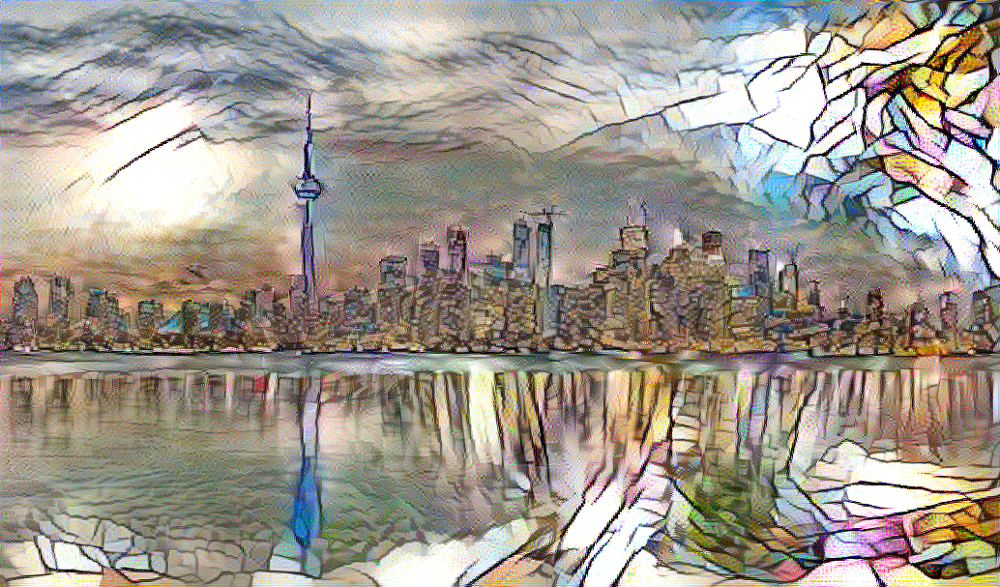
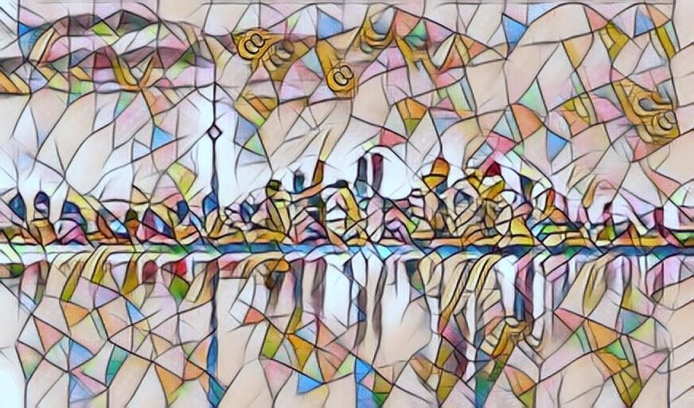
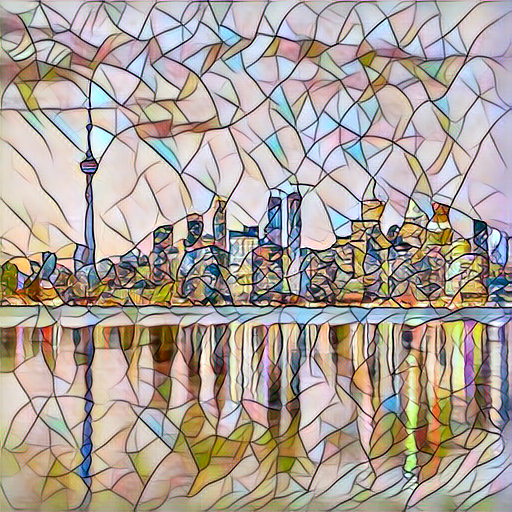

# CSC413 Final Project

## Project Goal
The aim of this project is to harness the transformative power of image style transfer in the realm of digital art and design. By leveraging advanced Deep Learning (DL) algorithms and datasets such as Microsoft COCO and select Kaggle collections, we seek to innovate within this space. Our mission is to empirically evaluate a spectrum of DL algorithms for image style transfer, gauging their efficacy through both quantitative measures like style coherence and processing efficiency, and qualitative assessments concerning content integrity.

## Prior Work
1. **Image Style Transfer Using Convolutional Neural Networks**: Introduces a seminal approach for merging the content of a target image with the style of a source image through Convolutional Neural Networks (CNNs), utilizing content and style representation techniques.

2. **Perceptual Losses for Real-Time Style Transfer and Super-Resolution**: Proposes the use of trained feed-forward CNNs optimized with perceptual loss functions, demonstrating enhancements in image style transfer.

3. **Multimodal Transfer: A Hierarchical Deep Convolutional Neural Network for Fast Artistic Style Transfer**: Suggests a novel hierarchical deep CNN structure for efficient style transfer that adeptly captures both the macro and micro-aesthetic elements of artistic styles across varying image scales.

## Implementation Process
The process involves training various models on image style transfer tasks and meticulously comparing the outputs. This comparison spans both quantitative aspects—like algorithmic loss and computational demand—and qualitative attributes, such as image fidelity and style integration.

### Running the Experiments

First of all, you'll have to download the [2014 Train/Val annotations](http://images.cocodataset.org/annotations/annotations_trainval2014.zip).

#### Base CNN (Inspired by the First Paper)
- **On GPU (teach.cs):** `srun -p csc413 --gres gpu python3 cnn.py`
- **On CPU:** `python3 cnn.py`
  - *Modify image paths in `cnn.py` (lines 118 and 119) to select different content and style images.*

#### Multimodal Style Transfer (Derived from the Third Paper)
- **For Training:** `srun -p csc413 --gres gpu python3 train_multimodal_net.py`
  - *Change the style image in `train_multimodal_net.py` (line 101) to use a different style.*
- **For Style Transferring:** Navigate to `transform_image.ipynb` to execute and observe the results.

#### Perceptual Loss Style Transfer (Based on the Second Paper)
- **To Train a Model for a Specific Style Image:** 
  ```shell
  srun -p csc413 --gres gpu pythons style.py train --style-image "path_to_style_image" --gpu "ID of the GPU"
- **To Transfer:**
  ```shell
  srun -p csc413 --gres gpu python3 style.py transfer --model-path "path_to_model" --source "path_to_content_image" --gpu "ID of the GPU" --output "path_to_output_image"

## Results
### Mosaic 
<p align="center">
    
</p>

### Original Image:
<p align="center">
    
</p>

### Generated Images:
CNN: 
<p align="center">
    
</p>

Multimodal:
<p align="center">
    
</p>

Perceptual Loss:
<p align="center">
    
</p>