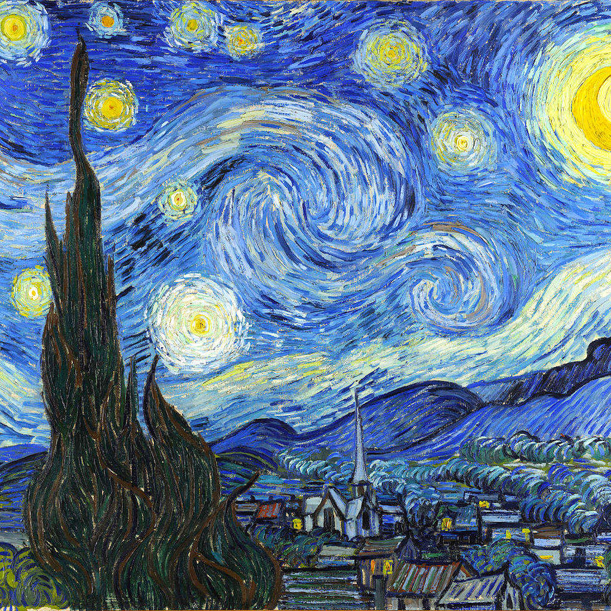
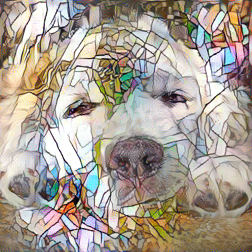
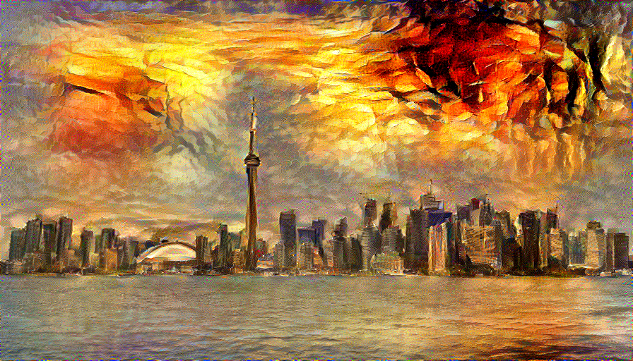
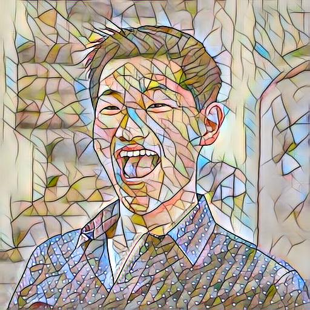

# CSC413 Final Project

## Project Goal
The aim of this project is to harness the transformative power of image style transfer in the realm of digital art and design. By leveraging advanced Deep Learning (DL) algorithms and Microsoft COCO dataset, we seek to innovate within this space. Our mission is to empirically evaluate a spectrum of DL algorithms for image style transfer, gauging their efficacy through both quantitative measures like style coherence and processing efficiency, and qualitative assessments concerning content integrity.

## Prior Work
1. **Image Style Transfer Using Convolutional Neural Networks**: Introduces a seminal approach for merging the content of a target image with the style of a source image through Convolutional Neural Networks (CNNs), utilizing content and style representation techniques.

2. **Perceptual Losses for Real-Time Style Transfer and Super-Resolution**: Proposes the use of trained feed-forward CNNs optimized with perceptual loss functions, demonstrating enhancements in image style transfer.

3. **Multimodal Transfer: A Hierarchical Deep Convolutional Neural Network for Fast Artistic Style Transfer**: Suggests a novel hierarchical deep CNN structure for efficient style transfer that adeptly captures both the macro and micro-aesthetic elements of artistic styles across varying image scales.

## Implementation Process
The process involves training various models on image style transfer tasks and meticulously comparing the outputs. This comparison spans both quantitative aspects—like algorithmic loss and computational demand—and qualitative attributes, such as image fidelity and style integration.

### Running the Experiments

First of all, you'll have to download the [2014 Train images](http://images.cocodataset.org/zips/train2014.zip).

#### Base CNN (Inspired by the First Paper)
- **On GPU (teach.cs):** `srun -p csc413 --gres gpu python3 cnn.py`
- **On CPU:** `python3 cnn.py`
  - *Modify image paths in `cnn.py` (lines 118 and 119) to select different content and style images.*

#### Multimodal Style Transfer (Derived from the Third Paper)
- **For Training:** `srun -p csc413 --gres gpu python3 train_multimodal_net.py`
  - *Change the style image in `train_multimodal_net.py` (line 101) to use a different style.*
- **For Style Transferring:** Navigate to `transform_image.ipynb` to execute and observe the results.

#### Perceptual Loss Style Transfer (Based on the Second Paper)
- **To Train a Model for a Specific Style Image:** 
  ```shell
  srun -p csc413 --gres gpu python3 style.py train --style-image "path_to_style_image" --gpu "ID of the GPU"
- **To Transfer:**
  ```shell
  srun -p csc413 --gres gpu python3 style.py transfer --model-path "path_to_model" --source "path_to_content_image" --gpu "ID of the GPU" --output "path_to_output_image"

## Results
### Style Images 
<p align="center">
    
    
    
    
</p>

### Content Image:
<p align="center">
    
    
    
</p>

### Generated Images:
CNN: 
<p align="center">
    
    
    
</p>

<p align='center'>
    
    
    
</p>

<p align='center'>
    
    
    
</p>

<p align='center'>
    
    
    
</p>

Multimodal:
<p align="center">
    
    
    
</p>
<p align="center">
    
    
    
</p>
<p align="center">
    
    
    
</p>
<p align="center">
    
    
    
</p>

Perceptual Loss:
<p align="center">
    
    
    
</p>

<p align='center'>
    
    
    
</p>

<p align='center'>
    
    
    
</p>

<p align='center'>
    
    
    
</p>

## Evaluation Results

### Model: CNN
| Content Image | Style Image | Generated Image | BRISQUE: Style | BRISQUE: Generated | SSIM | PSNR | GMSD |
|---------------|-------------|-----------------|----------------|--------------------|------|------|------|
|  |  |  | 12.55 | 34.02 | 0.160 | (11.50, 12.06, 9.79, inf) | (0.286, 0.285, 0.293, 0.0) |
| |  |  | 0.0 | 0.0 | 0.399 | (11.77, 16.84, 11.31, inf) | (0.218, 0.253, 0.272, 0.0) |
|  |  |  | 6.00 | 34.16 | 0.318 | (12.62, 11.55, 10.69, inf) | (0.231, 0.212, 0.226, 0.0) |
| |  |  | 19.76 | 36.80 | 0.108 | (9.69, 12.32, 12.38, inf) | (0.294, 0.294, 0.296, 0.0) |
|  |  |  | 12.55 | 36.36 | 0.144 | (6.32, 11.97, 9.10, inf) | (0.275, 0.265, 0.273, 0.0) |
|  |  |  | 0.0 | 17.76 | 0.226 | (5.30, 12.49, 10.03, inf) | (0.212, 0.236, 0.253, 0.0) |
|  |  |  | 6.00 | 36.29 | 0.423 | (6.99, 9.67, 12.78, inf) | (0.141, 0.139, 0.140, 0.0) |
|  |  |  | 19.76 | 35.21 | 0.346 | (12.44, 14.92, 16.32, inf) | (0.256, 0.249, 0.248, 0.0) |
|  |  |  | 12.55 | 40.14 | 0.158 | (9.53, 10.02, 9.74, inf) | (0.322, 0.330, 0.326, 0.0) |
|  |  |  | 0.0 | 34.43 | 0.162 | (8.69, 12.07, 11.78, inf) | (0.280, 0.281, 0.290, 0.0) |
|  |  |  | 6.00 | 34.29 | 0.327 | (11.14, 11.01, 9.73, inf) | (0.238, 0.196, 0.221, 0.0) |
|  |  |  | 19.76 | 36.23 | 0.115 | (10.16, 11.44, 9.70, inf) | (0.292, 0.295, 0.293, 0.0) |

### Model: Multimodal Style Transfer
| Content Image | Style Image | Generated Image | BRISQUE: Style | BRISQUE: Generated | SSIM | PSNR | GMSD |
|---------------|-------------|-----------------|----------------|--------------------|------|------|------|
|  |  |  | 12.55 | 16.14 | 0.277 | (10.11, 10.13, 9.43, inf) | (0.330, 0.339, 0.340, 0.0) |
|  |  |  | 0.0 | 13.52 | 0.397 | (11.77, 16.86, 11.32, inf) | (0.218, 0.254, 0.272, 0.0) |
|  |  |  | 6.00 | 23.40 | 0.743 | (14.63, 12.81, 10.41, inf) | (0.115, 0.123, 0.138, 0.0) |
|  |  |  | 19.76 | 11.61 | 0.290 | (10.93, 14.43, 12.90, inf) | (0.273, 0.261, 0.261, 0.0) |
|  |  |  | 12.55 | 16.73 | 0.302 | (11.66, 13.41, 9.43, inf) | (0.330, 0.334, 0.330, 0.0) |
|  |  |  | 0.0 | 17.76 | 0.226 | (5.30, 12.49, 10.03, inf) | (0.212, 0.236, 0.253, 0.0) |
|  |  |  | 6.00 | 36.29 | 0.423 | (6.99, 9.67, 12.78, inf) | (0.141, 0.139, 0.140, 0.0) |
|  |  |  | 19.76 | 18.40 | 0.346 | (12.44, 14.92, 16.32, inf) | (0.257, 0.249, 0.248, 0.0) |
|  |  |  | 12.55 | 15.84 | 0.218 | (8.72, 9.08, 8.92, inf) | (0.333, 0.341, 0.343, 0.0) |
|  |  |  | 0.0 | 15.78 | 0.301 | (7.77, 11.79, 12.27, inf) | (0.226, 0.255, 0.279, 0.0) |
|  |  |  | 6.00 | 32.11 | 0.546 | (9.89, 8.99, 7.35, inf) | (0.132, 0.137, 0.152, 0.0) |
|  |  |  | 19.76 | 14.47 | 0.256 | (11.76, 12.47, 9.72, inf) | (0.263, 0.250, 0.255, 0.0) |


### Model: PerceptualLoss Style Transfer
| Content Image | Style Image | Generated Image | BRISQUE: Style | BRISQUE: Generated | SSIM | PSNR | GMSD |
|---------------|-------------|-----------------|----------------|--------------------|------|------|------|
|  |  |  | 12.55 | 8.61 | 0.368 | (10.21, 9.99, 9.42, inf) | (0.320, 0.331, 0.327, 0.0) |
|  |  |  | 0.0 | 0.0 | 0.599 | (14.35, 20.11, 10.75, inf) | (0.146, 0.150, 0.154, 0.0) |
|  |  |  | 6.00 | 13.90 | 0.862 | (17.84, 15.46, 12.21, inf) | (0.064, 0.066, 0.066, 0.0) |
|  |  |  | 19.76 | 16.17 | 0.389 | (11.63, 15.77, 15.78, inf) | (0.253, 0.252, 0.251, 0.0) |
|  |  |  | 12.55 | 10.59 | 0.372 | (12.03, 13.99, 9.54, inf) | (0.317, 0.321, 0.315, 0.0) |
|  |  |  | 0.0 | 1.97 | 0.350 | (6.51, 17.65, 10.23, inf) | (0.152, 0.145, 0.148, 0.0) |
|  |  |  | 6.00 | 27.78 | 0.471 | (7.88, 10.59, 13.74, inf) | (0.133, 0.129, 0.129, 0.0) |
|  |  |  | 19.76 | 23.64 | 0.443 | (14.57, 15.87, 18.01, inf) | (0.233, 0.234, 0.229, 0.0) |
|  |  |  | 12.55 | 12.24 | 0.316 | (8.92, 9.93, 10.16, inf) | (0.325, 0.333, 0.333, 0.0) |
|  |  |  | 0.0 | 0.0 | 0.476 | (9.55, 17.25, 13.68, inf) | (0.155, 0.156, 0.169, 0.0) |
|  |  |  | 6.00 | 21.16 | 0.652 | (10.74, 9.58, 7.80, inf) | (0.084, 0.080, 0.083, 0.0) |
|  |  |  | 19.76 | 16.05 | 0.391 | (12.92, 13.89, 10.92, inf) | (0.237, 0.240, 0.243, 0.0) |


## Understanding Image Quality Metrics

In our evaluation of style transferred images, we use several metrics to quantitatively measure the quality and effectiveness of our style transfer models. Below is a brief explanation of each metric and what it signifies:

### BRISQUE Score
- **BRISQUE (Blind/Referenceless Image Spatial Quality Evaluator)** measures the naturalness of an image on a scale where a lower score indicates a more natural-looking image. It is a no-reference metric that does not require a reference image to calculate the score. In the context of style transfer, a lower BRISQUE score for the generated image generally suggests a more visually appealing result.

### SSIM (Structural Similarity Index)
- **SSIM** is a metric used to measure the similarity between two images. The SSIM index is a decimal value between -1 and 1; a score of 1 indicates perfect similarity. This is useful for assessing how much of the content from the content image is preserved in the style-transferred output relative to the original content layout and structure.

### PSNR (Peak Signal-to-Noise Ratio)
- **PSNR** is used to measure the quality of reconstruction or, in our case, the quality of the style transfer. It compares the similarity between the content image and the style-transferred image in terms of their pixel value differences. Higher PSNR values indicate better quality, as there is less distortion introduced by the style transfer process.

### GMSD (Gradient Magnitude Similarity Deviation)
- **GMSD** evaluates the quality of textures and structural information preserved in the transferred image compared to the original content image. Lower GMSD values generally indicate better preservation of textural and structural integrity.

## Score Interpretation in Tables

The following tables present the computed metrics for each style transfer model applied across different style and content images. Each entry provides a snapshot of how well the model performed according to the above metrics. Use these scores to compare the performance of different models and to select the most effective style transfer approach based on your specific criteria for image quality and artistic coherence.

Multimodal Style Transfer:

| Content Image | Style Image | Generated Image | BRISQUE: Style | BRISQUE: Generated | SSIM | PSNR | GMSD |
|---|---|---|---|---|---|---|---|
|  |  |  | 0.0 | 13.517 | 0.397 | (11.773, 16.860, 11.325, inf) | (0.218, 0.254, 0.272, 0.0) |
|  |  |  | 6.001 | 36.289 | 0.423 | (6.988, 9.667, 12.775, inf) | (0.141, 0.139, 0.140, 0.0) |
|  |  |  | 19.759 | 14.468 | 0.256 | (11.763, 12.474, 9.716, inf) | (0.263, 0.250, 0.255, 0.0) |

### Notes:
- **BRISQUE: Style vs. Generated:** Compare these scores to assess how the introduction of style has affected the naturalness of the image.
- **SSIM, PSNR, GMSD:** These scores together give a comprehensive view of the image integrity and aesthetic quality post style transfer.

## Loss Functions and Plots:
CNN: 
<p align="center">
     
</p>

Multimodal:
<p align="center">

</p>

Perceptual Loss:
<p align="center">

</p>